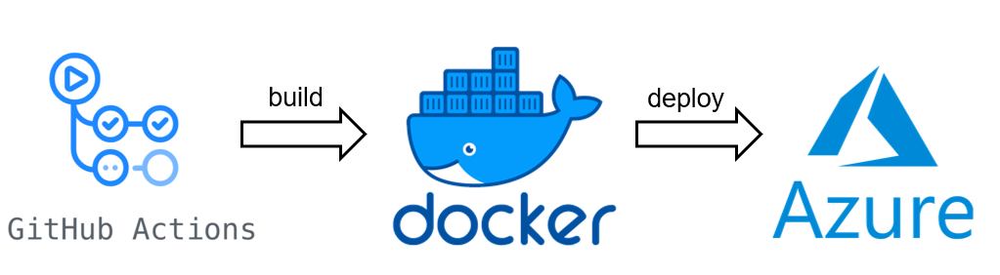

# Covid Mercury Dashboard for AUT

## Architecture




## GitHub Action

Link: https://github.com/autbartl/sdc-project/actions


## Docker

#### Docker Hub
https://hub.docker.com/repository/docker/ds21m029/mercury-dashboard-bartl/general

#### Dockerfile

```
FROM jupyter/datascience-notebook:latest

EXPOSE 8000

WORKDIR /app

COPY ./requirements.txt /app
COPY ./mercury-notebook.ipynb /app
COPY ./CovidFaelle_Altersgruppe.csv /app

RUN pip install -r requirements.txt

CMD ["mercury", "run", "0.0.0.0:8000", "mercury-notebook.ipynb"]
```

## Azure Web App

https://sdc-final-project.azurewebsites.net/
